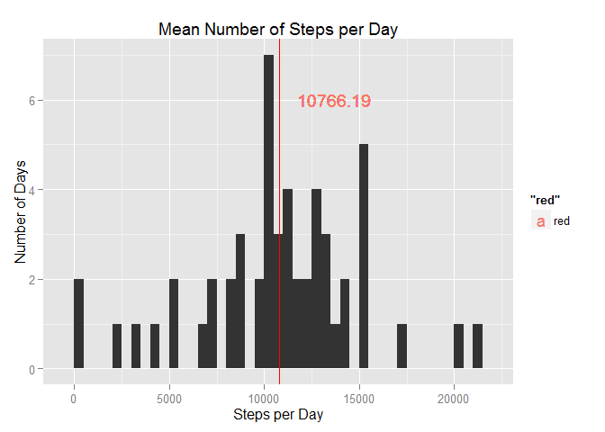
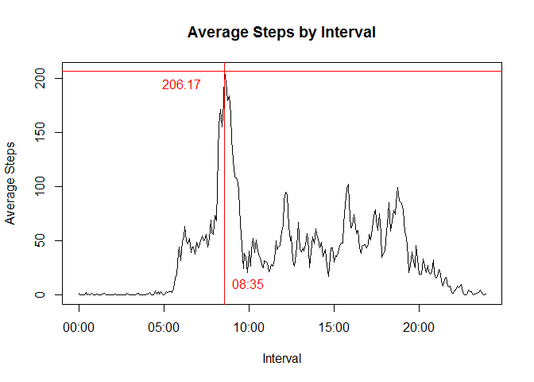
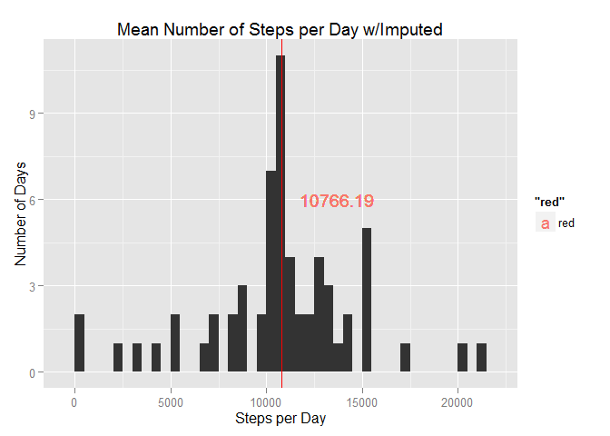
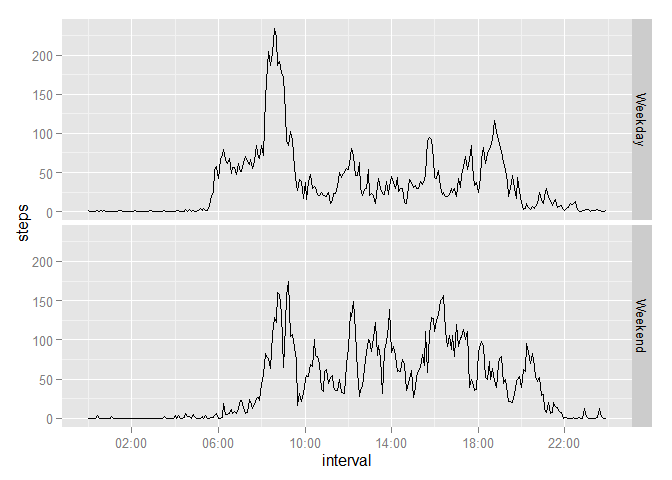

# Reproducible Research: Peer Assessment 1


## Loading and preprocessing the data

Clear environment, load libraries, set working directory, read in file

```r
rm(list=ls())
library(data.table)
library(datasets)
library(sqldf)
library(dplyr)
library(lubridate)
library(ggplot2)
library(timeDate)
library(scales)

setwd("C:/coursera/RepData_PeerAssessment1")
getwd()
```

```
## [1] "C:/coursera/RepData_PeerAssessment1"
```

Note: due to my company firewall, I can't automate the web pull or "unzipping".
Starting with the activity.csv file landed locally.


```r
amd<-read.csv('activity.csv')
head(amd)
```

```
##   steps       date interval
## 1    NA 2012-10-01        0
## 2    NA 2012-10-01        5
## 3    NA 2012-10-01       10
## 4    NA 2012-10-01       15
## 5    NA 2012-10-01       20
## 6    NA 2012-10-01       25
```

Preprocessing: date and interval fields to datetime types, create daily and interval aggregates


```r
# date to datetime data type

amd$date<-as.Date(amd$date)

# interval to datetime data type  
amd$interval<-as.POSIXct(strptime(sprintf("%04d",amd$interval),"%H%M"))

# note: interval date part defaults to today, format x-axis later to accomodate

# aggregate: total steps by day 
amd_daily<-aggregate(steps~date,amd,sum)

# aggregate: average steps by interval
amd_interval<-aggregate(steps~interval,amd,mean)
```

## What is mean total number of steps taken per day?

Calculate daily mean, median, and visualize.


```r
# calculate mean
daily_mean<-mean(amd_daily$steps,na.rm=TRUE)
daily_mean
```

```
## [1] 10766.19
```

```r
# calculate median
daily_median<-median(amd_daily$steps,na.rm=TRUE)
daily_median
```

```
## [1] 10765
```

```r
# visualize with ggplot
g<-qplot(steps,data=amd_daily,binwidth=500)
g+geom_vline(xintercept=daily_median,col="blue",lwd=0.5)+
geom_vline(xintercept=daily_mean,col="red",lwd=0.5)+
geom_text(aes(daily_mean,6,label=round(daily_mean,2),hjust=-.25,color="red"))+
labs(title="Mean Number of Steps per Day",x="Steps per Day",y="Number of Days")   
```

 

Daily mean: 10766.19
Daily median: 10765.00

Note: due to scale, median (in blue) may not be visible under the mean (in red)

## What is the average daily activity pattern?

Calculate the maximum average number of steps and the associated interval, visualize


```r
# visualize with barplot

# calculate maximum steps
max_steps<-max(amd_interval$steps)
max_steps
```

```
## [1] 206.1698
```

```r
# calculate interval with maximum steps
max_interval<-amd_interval[which.max(amd_interval$steps),1]
max_interval
```

```
## [1] "2015-08-13 08:35:00 CDT"
```

```r
# visualize with time series plot (type ="l" per the instructions)

plot.new()
plot(amd_interval$interval
        ,amd_interval$steps
        ,type="l"
        ,main="Average Steps by Interval"
        ,xlab="Interval"
        ,ylab="Average Steps"
        )

#horizontal line crossing y axis at maximum # of steps, with label

abline(h=max_steps,col="red",lwd=1)
text(x=(max_interval-9000),y=max_steps,labels=round(max_steps,2),col="red",pos=1)

#vertical line crossing x axis at interval with max # of steps, with time label

abline(v=max_interval,col="red",lwd=1)
text(x=max_interval,y=10,labels=format(max_interval,format="%H:%M"),col="red",pos=4)
```

 

Maximum average steps 206.17
at interval 08:35

## Imputing missing values

Impute missing values: apply interval-level averages to each interval with missing data


```r
# Total # of rows with missing values
sum(!complete.cases(amd))
```

```
## [1] 2304
```

```r
# apply interval-level averages to missing intervals
imputed_amd<-transform(amd
        ,steps=ifelse(is.na(amd$steps)
        ,amd_interval$steps[match(amd$interval,amd_interval$interval)]
        ,amd$steps))

# validate that there are no missing values
sum(!complete.cases(imputed_amd))
```

```
## [1] 0
```

```r
#histogram of total daily

#create imputed daily totals
imputed_amd_daily<-aggregate(steps~date,imputed_amd,sum)
str(imputed_amd_daily)
```

```
## 'data.frame':	61 obs. of  2 variables:
##  $ date : Date, format: "2012-10-01" "2012-10-02" ...
##  $ steps: num  10766 126 11352 12116 13294 ...
```

```r
# calculate mean
imputed_daily_mean<-mean(imputed_amd_daily$steps)
imputed_daily_mean
```

```
## [1] 10766.19
```

```r
# calculate median
imputed_daily_median<-median(imputed_amd_daily$steps)
imputed_daily_median
```

```
## [1] 10766.19
```

```r
#difference between imputed and original:
#mean
imputed_difference_mean<-imputed_daily_mean-daily_mean
imputed_difference_mean
```

```
## [1] 0
```

```r
#and median
imputed_difference_median<-imputed_daily_median-daily_median
imputed_difference_median
```

```
## [1] 1.188679
```

```r
# note - with this imputation method, the mean is unchanged
# the new median is a decimal and is equal to the mean (allowed fractional steps)

#visualize with ggplot
g<-qplot(steps,data=imputed_amd_daily,binwidth=500)
g+geom_vline(xintercept=imputed_daily_median,col="blue",lwd=0.5)+
geom_vline(xintercept=imputed_daily_mean,col="red",lwd=0.5)+
geom_text(aes(imputed_daily_mean,6,label=round(imputed_daily_mean,2),hjust=-.25,color="red"))+
labs(title="Mean Number of Steps per Day w/Imputed",x="Steps per Day",y="Number of Days") 
```

 

Original mean: 10766.19
Imputed mean: 10766.19

The imputed mean is unchanged due to the imputation method

Original median: 10765.00
Imputed median: 10766.19

Median becomes equal to the mean due to the imputation method, and is not a whole number since the imputed values are averages with decimal places

## Are there differences in activity patterns between weekdays and weekends?

1. Create a weekend indicator


```r
# create days
amd$weekday<-wday(amd$date,label=TRUE,abbr=TRUE)
table(amd$weekday)
```

```
## 
##   Sun   Mon  Tues   Wed Thurs   Fri   Sat 
##  2304  2592  2592  2592  2592  2592  2304
```

```r
# create days, weekend flag and indicator
amd$weekday<-wday(amd$date,label=TRUE,abbr=TRUE)
amd$weekend_flag<-factor(isWeekend(amd$date))
amd$weekend_indicator<-ifelse(amd$weekend_flag==TRUE,c("Weekend"),c("Weekday"))
# validate
table(amd$weekend_indicator,amd$weekday)
```

```
##          
##            Sun  Mon Tues  Wed Thurs  Fri  Sat
##   Weekday    0 2592 2592 2592  2592 2592    0
##   Weekend 2304    0    0    0     0    0 2304
```


2. Create the panel plot

```r
# create the agg table with the weekend indicator

amd_interval_weekends<-sqldf('
        select 
                weekend_indicator
                ,interval
                ,avg(steps) as steps 
        from 
                amd 
        group by 
                weekend_indicator
                ,interval
        order by 
                weekend_indicator
                ,interval
        ')
```

```
## Loading required package: tcltk
```

```r
head(amd_interval_weekends)
```

```
##   weekend_indicator            interval steps
## 1           Weekday 2015-08-13 00:00:00     2
## 2           Weekday 2015-08-13 00:05:00     0
## 3           Weekday 2015-08-13 00:10:00     0
## 4           Weekday 2015-08-13 00:15:00     0
## 5           Weekday 2015-08-13 00:20:00     0
## 6           Weekday 2015-08-13 00:25:00     1
```

```r
# plot weekday and weekend interval patterns, stacked 
g<-ggplot(data=amd_interval_weekends,aes(interval,steps))
g+geom_line(stat="identity")+facet_grid(weekend_indicator~.)+
scale_x_datetime(breaks = date_breaks("4 hour"),labels=date_format("%H:%M",tz="EST"))
```

 

Weekend activity starts later, doesn't peak as high initially, and is heavier throughout the rest of the day.  
Assumption: People are sleeping in and not working!

Note: I had to set the timezone in the x-axis format to EST to get the correct intervals 12am-11:59pm. Otherwise the graphs start at 5am and end at 4:59am. I think it may be assuming UTC otherwise and attempting to adjust?


